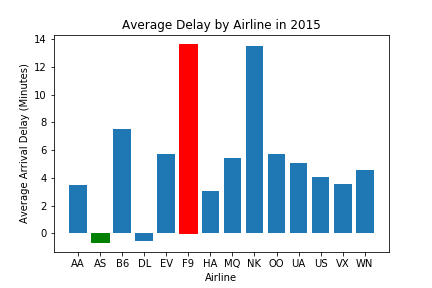
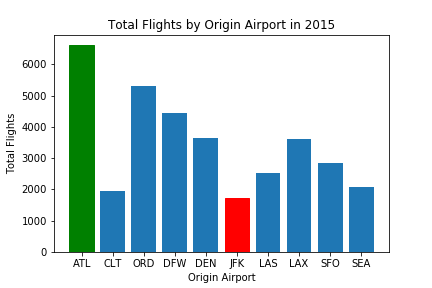
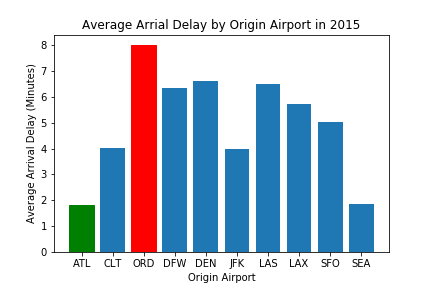
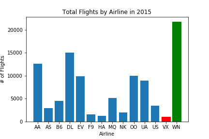
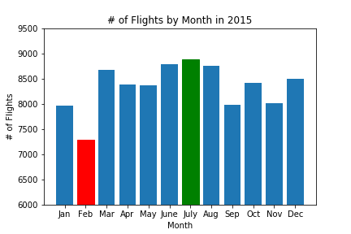
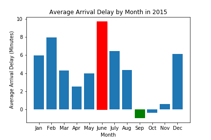
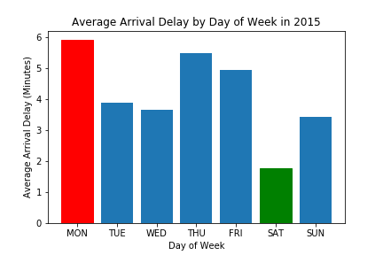

# Flight Delays in 2015

### Team Members:
Joe Barcus, Richard Burger, Vivian Plasencia, & Dylan Rossi

### Project Description:
We will be analyzing flight data from 2015 to find trends in flight delays

### Research Questions to Answer:
1. What is the average arrival delay for each airline
2. What is the average arrival delay for the top 10 US airports
3. Which airport has the most flights in 2015
4. Which airline had the most flights in 2015
5. Which month has the most flights in 2015
6. Which month has the highest/lowest average arrival delay in 2015
7. Which day of the week has the highest/lowest average arrival delay in 2015

### Datasets to be Used:
Department of Transportation (DOT) Dataset of On-Time Performance of Airlines

### Breakdown of Tasks

1. Get Dataset
2. Take sample of 100,000 flights
3. Breakdown & Analyze Data Set
4. Get average airline Data
5. get average airport Data
6. get average monthly Data
7. get average weekly Data
8. Graph using MatPlotLib
9. Find best and worst in each category

## Questions - Answered
#### 1. What is the average arrival delay for each airline

* Frontier & Spirit Airlines were, on average, the latest airlines with average arrival delays of ~13.6 minutes & ~13.5 minutes respectively.
* Alaska & Delta Airlines, on average, arrived earlier than scheduled. With average arrival delays of ~-0.6 minutes & ~- 0.5 minutes

#### 2. Which airport has the most flights in 2015

###### NOTE: Data is out of 100,000 flights, not all flights for 2015

###### NOTE: Data is from when the airports were the starting point for the flight.

* ATL is the busiest airport. They were the origin for 6,622 (~6.6%) of the 100,000 flights sampled.
* Out of the top 10 busiest airports, JFK, is the least busy. They were the origin for 1,734 (~1.7%) out of 100,000 sampled flights.

#### 3. What is the average arrival delay for the top 10 US airports

###### NOTE: Data is out of 100,000 flights, not all flights for 2015

###### NOTE: Data is from when the airports were the starting point for the flight.

* Out of the top 10 busiest airports, Chicago had the longest average delay of ~8.0 minutes
* Atlanta, the busiest airport, amazingly had the shortest delays on average, with an average arrival delay of ~1.8 minutes. This connects with Delta having one of the lowest arrival delays because ATL is Delta's min hub.

#### 4. Which airline had the most flights in 2015

###### NOTE: Data is out of 100,000 flights, not all flights for 2015

* Of the 100,000 sample flights, Southwest Airlines had the most flights by a large margin. They accounted for 21,746 (~21.7%) of the 100,000 sampled. The next closest airline was Delta with 15,006 (~15.0%).
* Virgin America Had the lowest amount of flights from the sample. They only accounted for 1,004 (~1.0%) of the 100,000 sampled.

#### 5. Which month has the most flights in 2015

###### NOTE: Data is out of 100,000 flights, not all flights for 2015

* Each month was very close to each other with July just barely being the most busy (could just be from the sample selected).
* However, there is a drastic decrease in flights in February, where only 7.3% of flights occured. This is most likely simply because there are less days in Februay than the other months if it had 30 or 31 days like the other months, it would obviously have more flights.

#### 6. Which month has the highest/lowest average arrival delay in 2015

* June had the highest average arrival delay of ~9.7 minutes.
  - This could possibly be due to school letting out for students and allowing them and their parents to have time to travel and go on vacation.
  - This could be said about everyone as well since the weather is getting nice and people from less fortunate states, such as PA, can leave and experince a beach.
* If you left in September or October, on average, your flight would have been early by ~0.9 and ~0.4 minutes respectively.
  - The inverse can be said for September and October. School is starting again and kids and young adults will be back in school and not allow families to have the opportunity to travel as much.
* Another jump can be seen in December. Most likely due to people getting home for the holidays and again students being on break and having time to travel.

#### 7. Which day of the week has the highest/lowest average arrival delay in 2015

* It can easily be seen that Saturday has the shortest arrival delay, with an average arrival delay of ~1.8 minutes.
* Monday is just barely has the highest average delay with an average of ~5.9 minutes, with Thursday trailing behind with an average of ~5.5 minutes.

## Conclusion
1. Based on this data the best way to arrive the earliest, when leaving from a top 10 airport in the US, would be to leave from ATL on a Alaskian Airline Flight on a Saturday in September.
2. To Arrive as late as possible from a top 10 airport in the US, you should fly out of Chicago on a Frontier Airline flight on a Monday in June.

3. To have the worst flight experience possible, fly on United with your dog.

#### Disclaimer: This is not real travel advice, it is only based on the data and the results analyzed from this sample from 2015.
